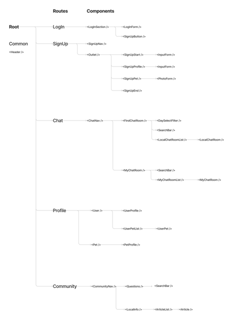
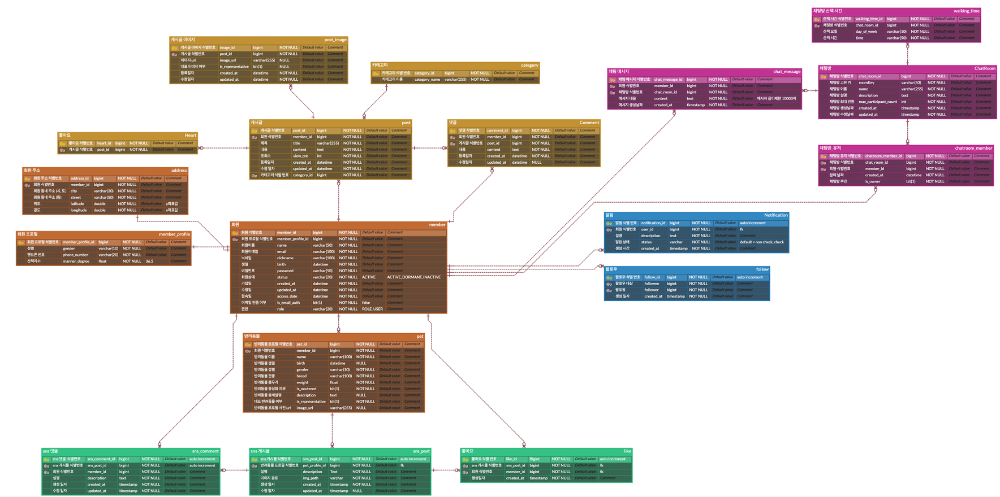

# GAEthering 프로젝트 프론트엔드 팀

> 🥲 서버비용의 문제로 서버 배포가 중단되었습니다.

## 프로젝트 개요

- 최근 반려견을 키우는 인구는 지속적으로 증가하고 있고, 반려견 산책의 중요도는 높아지고 있습니다.
- 같은 아파트 단지 내에서 오픈채팅을 활용하거나, 당근마켓 동네생활 등으로 강아지 산책관련 모임을 만드는 사례들이 많은 것을 발견했습니다.
- 이를 별도의 서비스로 분리하여 반려동물 기반의 커뮤니티 서비스를 개발하기로 하였습니다.

## 구현 화면

### 회원가입

- 이메일 인증

  - 이메일로 발송된 UUID로 생성된 무작위 코드를 입력하여야 합니다.
  - 이메일 인증을 완료하지 않으면 다음으로 넘어갈 수 없습니다.
    

- 회원가입 과정
  - 각 항목마다 validation을 진행하며 통과하지 못하면 다음 단계로 갈 수 없습니다.
    

### 프로필

- 반려동물 추가
  

- 반려동물 수정
  

### 게시판(동네정보, 질문게시판)

- 게시판 목록에서는 내용의 일부와 대표이미지만 볼 수 있습니다.
- **더보기**나 게시글 제목을 클릭하면 상세내용을 확인할 수 있습니다.

- 댓글 작성
  

- 게시글 작성
  - 게시글에는 최대 3개의 이미지를 등록할 수 있습니다.
  - 이미지는 삭제가 가능합니다.
    

### 로그인, 로그아웃

- 로그인 시 잘못된 내용을 유저가 쉽게 파악할 수 있도록 하였습니다.
  
  

### 채팅(산책모임) 기능

- 채팅방 만들기

  - 채팅방을 만들 때 원하는 산책시간을 지정할 수 있습니다.
    

- 여러 유저간의 원활한 채팅이 가능합니다.
  

### 반응형 UI

- 반응형 UI를 적용하여 모바일에서도 사용이 가능합니다.
  

---

## 설계 사항

### UI Prototype [🔗Figma🎨](https://www.figma.com/file/AHNY7fBcHgAllLdICGGoO9/GAEthering?node-id=0%3A1&t=WEimQyz3wO5P4bN4-1)


### 컴포넌트 구조 설계

- 원활한 협업을 위해 컴포넌트를 미리 구조화하여 설계하였습니다.
  

### ERD 설계



### 폴더 구조

```bash
📦src
 ┣ 📂api
 ┣ 📂assets
 ┣ 📂components
 ┃ ┣ 📂Chat
 ┃ ┣ 📂ChatRoom
 ┃ ┣ 📂Community
 ┃ ┣ 📂Form
 ┃ ┣ 📂NavBar
 ┃ ┣ 📂Profile
 ┃ ┣ 📂Root
 ┃ ┣ 📂SignUp
 ┃ ┗ 📂widgets
 ┣ 📂data
 ┣ 📂Hooks
 ┣ 📂pages
 ┣ 📂themes
 ┗ 📂util
```

| 폴더 이름  | 용도                                                    |
| ---------- | ------------------------------------------------------- |
| api        | API 호출 함수 및 타입 정의 <br /> React Query 관련 함수 |
| assets     | 로고, 아이콘 등의 asset 파일들                          |
| components | 세부 컴포넌트들을 page별로 정리                         |
| data       | 정규표현식, 환경변수 등 정적 Data                       |
| hooks      | 공통으로 사용하는 hooks                                 |
| pages      | Route 별 최상위 컴포넌트                                |
| themes     | 전체 테마 정의 파일                                     |
| util       | 공통으로 사용하는 utils                                 |

---

## Tech Stack

### React + Typescript

- Typescript를 strict mode로 적용하였습니다.
  - any type과 type assertion을 사용하지 않았습니다.
  - Generic type과 interface를 적극적으로 활용하여 API 호출에 활용하였습니다.
- 공통적으로 사용되는 컴포넌트를 추상화하여 widget으로 사용하였습니다.

### Styled Components

- 스타일 컴포넌트를 별도로 분리하여 스타일 관리하였습니다.
- 공통된 스타일은 별도의 컴포넌트로 만들어 재활용하였습니다.
- Theme Provider를 이용하여 Dark mode 등 테마 변경이 용이하도록 하였습니다.

### React Query

- Query Client를 활용하여 API 호출은 줄이고 사용자 경험은 향상시킬 수 있었습니다.
  - 캐싱을 통해 화면 깜빡임을 최소화하였습니다.
- Query Key를 별도 상수로 관리하여 오타 등의 위험을 줄였습니다.

### Axios

- Generic Type을 활용해 API 호출 공통 함수를 만들어 에러 관리를 편리하게 하였습니다.
- Axios intercept를 이용해 JWT 갱신을 자동으로 처리하였습니다.

### React Hook Form

- 불필요한 리렌더링이 발생하는 React 제어 폼 대신 React Hook Form을 사용하였습니다.
- onTouched, isValid 등의 옵션을 활용하여 사용자 경험을 향상시켰습니다.

## 고민한 점 + 기여한 점(정영훈)

### 회원가입 + 로그인

- 회원가입과 로그인 과정에서 에러 처리와 유효성 검사를 최대한 자연스럽게 이루어지게 하기 위해 고민했습니다.

  - 재사용 가능한 Input 컴포넌트를 만들어 협업시의 디자인 통일과 개발 경험을 높였습니다.

  ```ts
  function Input<T extends FieldValues>({
    label,
    plHolder,
    name,
    type = 'text',
    required,
    register,
    options,
  }: InputProp<T>) {
    return (
      <StyledInput className="input-container">
        <label>
          {label && <div className="label">{label}</div>}
          <input
            {...register(name, options)}
            placeholder={plHolder}
            required={required}
            autoComplete="off"
            type={type}
          />
        </label>
      </StyledInput>
    );
  }
  ```

### JWT 인증

- Axios intercept를 이용하여 access token이 만료되어도 자동으로 갱신할 수 있도록 처리

```ts
function setAxiosIntercept() {
  axios.interceptors.request.use(async (config) => {
    if (!getAccessToken()) {
      return config;
    }

    if (
      getTokenExpirationDate(getAccessToken()) <
      new Date(Date.now() + 2 * 60000)
    ) {
      await postReToken();
    }
    return config;
  });
}
```

### 게시판(커뮤니티) 기능

- FormData를 이용하여 사진과 JSON Data를 동시에 실어보냈습니다.

```ts
const onSubmit: SubmitHandler<PostArticleRequest> = async (data) => {
  const formData = new FormData();
  const jsonData = JSON.stringify(data);
  const blob = new Blob([jsonData], { type: 'application/json' });

  images[0] ?? formData.append('images', new Blob());
  images.forEach((img) => formData.append('images', img));

  formData.append('data', blob);

  mutate(formData);
};
```

- React Query의 InfiniteQuery를 이용하여 연속적인 호출을 처리하였습니다.
- 게시글, 댓글 작성 시 바로 반영이 되도록 invalidateQueries를 이용했습니다.

```ts
function ArticleComments() {
  // 생략

  const { data, fetchNextPage, hasNextPage } = useInfiniteQuery(
    [...QueryKeys.ArticleComments, postId],
    fetch,
    {
      getNextPageParam: (lastPage) => lastPage.nextCursor,
      onSuccess: (data) => {
        console.log(data);
      },
    }
  );

  const onSubmit: SubmitHandler<PostCommentRequest> = async (data) => {
    const res = await postComment(postId ?? '', data.content);

    console.log('POST', res, isSubmitSuccessful);

    res &&
      queryClient.invalidateQueries([...QueryKeys.ArticleComments, postId]);
    reset();
  };

  // 생략
}
```

### WebSocket을 이용하여 채팅 기능 구현

- StompJS를 이용하여 메시지 프로토콜을 간단하게 정의하였습니다.
- WebSocket에 React Query를 함께 사용하여 메시지 기록이 바로 반영이 되도록 하였습니다.

---

## 개선사항 (아쉬운 점)

- 한 컴포넌트 안에 비즈니스 로직과 View가 같이 구현되어 있어 유지보수가 어렵습니다.
  - 리팩토링하여 분리가 필요합니다.
- Page와 Component 폴더 간의 관계가 명확하지 않습니다.
  - Page 폴더에는 각 Route의 view만 들어있을 수 있게 리팩토링이 필요합니다.
- Theme Provider를 사용하였으나 Dark Mode를 추가하지 못했습니다.
- Desktop View에서 어색하게 보이는 UI들이 있습니다.
- 초기 동네 인증 기반으로 설계하였으나 시간의 문제로 구현하지 못하였습니다.
- 협업 프로젝트 최종 발표 기한이 짧아 API나 Client가 구현되지 못한 기능들이 있습니다.
  - 게시글 및 댓글 수정, 삭제 기능
  - 채팅방 관련 기능들
  - 회원 탈퇴 기능 등
- 서버 비용의 문제로 배포가 중단되었습니다.
